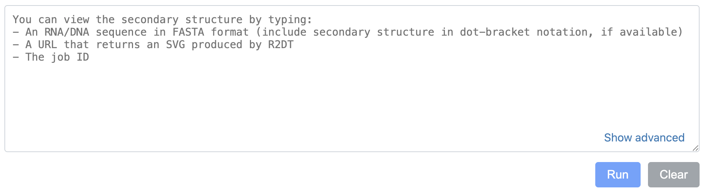
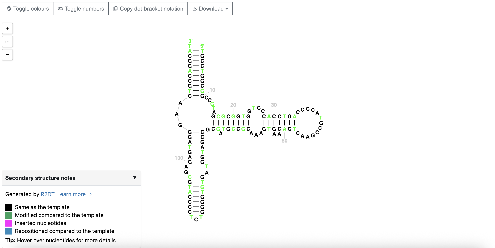
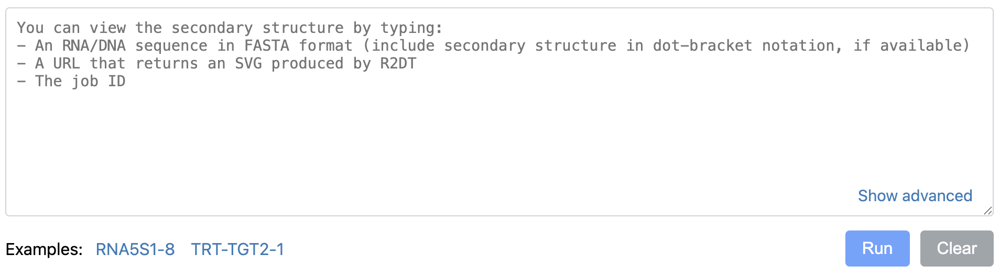

# R2DT-Web

This is an embeddable component that you can include in your website to visualise RNA secondary structures.

## How to use

Only two lines of code are needed to use this widget: one line with the r2dt-web tag and another with the script 
for this component, for example:

```
<r2dt-web/>
<script type="text/javascript" src="/path/to/r2dt-web.js"></script>
```    
And then the component provides a simple input box where you can paste an RNA/DNA sequence, URL or job ID.


To use the latest stable version without worrying about updates, use the component's JavaScript package available at 
GitHub:

`<script type="text/javascript" src="https://rnacentral.github.io/r2dt-web/dist/r2dt-web.js"></script>`

If you prefer to install this package and perform the updates manually, see the [Installation](#Installation) section.

### Other methods of use

If you already have an external URL that returns an SVG generated by R2DT, you can provide it through the 
`search` attribute as a JSON object.

```
<r2dt-web search='{"url": "https://example.com/svg"}'></r2dt-web>
```

To load an RNAcentral identifier (URS), pass it in the same way:

```
<r2dt-web search='{"urs": "URS0000049E57"}'></r2dt-web>
```



Click [here](https://rnacentral.org/help#how-to-find-rnacentral-id) to see how you can find an RNAcentral identifier 
for an RNA sequence.

If neither `url` nor `urs` is provided, the component will display a search field. You can optionally display example 
sequences using the `examples` attribute.

```
<r2dt-web 
    examples='[
        {"description": "RNA5S1-8", "sequence": "GUCUACGGCCAUACCACCCUGAACGCGCCCGAUCUCGUCUGAUCUCGGAAGCUAAGCAGGGUCGGGCCUGGUUAGUACUUGGAUGGGAGACCGCCUGGGAAUACCGGGUGCUGUAGGCUUU"},
        {"description": "TRT-TGT2-1", "sequence": "GGCTCCATAGCTCAGTGGTTAGAGCACTGGTCTTGTAAACCAGGGGTCGCGAGTTCGATCCTCGCTGGGGCCT"}
    ]'
/>
```



## Installation

Clone this repository from GitHub.

`git clone https://github.com/RNAcentral/r2dt-web.git`

Now you can add the component's JavaScript bundle (it contains all the styles and fonts) to your web page either 
directly or through an import with Webpack:

`<script type="text/javascript" src="/r2dt-web/dist/r2dt-web.js"></script>`

## Attributes/parameters

This component accepts a number of attributes. You pass them as html attributes and their values are strings 
(this is a requirement of Web Components):

| parameter | description                                                            |
|-----------|------------------------------------------------------------------------|
| search    | JSON object with `url` or `urs` attributes                             |
| examples  | Array of example sequences with `description` and `sequence`           |
| legend    | Legend position (left by default). Can be `left`, `right` and `center` |

### Local development

1. `npm install`

2. `npm run update-templates` to use the latest models from the R2DT repository

3. `npm start` to start a server on http://localhost:9000/

4. `npm run build` to generate a new distribution

5. `npm test` to run unit tests

### Notes

- Implemented as a Web Component using pure JavaScript — no React or Redux dependencies.
- If both `url` and `urs` are provided, `urs` takes precedence.
